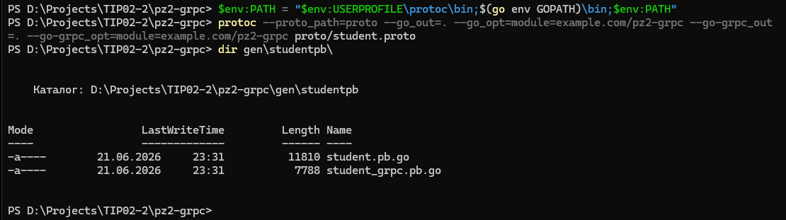
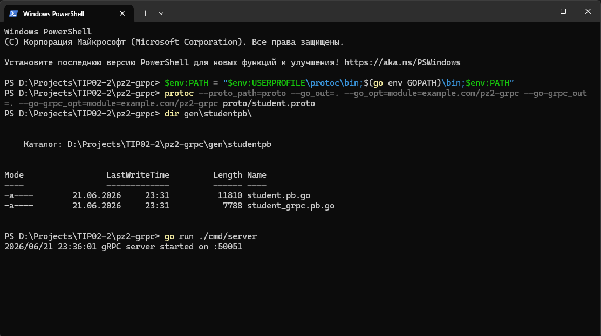
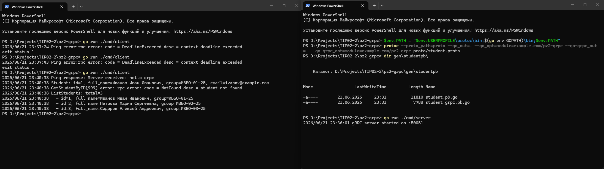

# Практическое занятие №2
# gRPC: создание простого микросервиса, вызовы методов

**Дисциплина:** Технологии индустриального программирования  
**Семестр:** 2, 2025-2026  
**Студент:** Альбутов Александр Андреевич, ЭФМО-01-25

---

## Краткое описание проекта

Реализован gRPC-микросервис `StudentService` на языке Go с тремя методами:

- **Ping** — проверка доступности сервиса, возвращает эхо-ответ.
- **GetStudentByID** — возвращает данные студента по числовому идентификатору; при отсутствии записи возвращает gRPC-ошибку `NotFound`.
- **ListStudents** (доп. задание, вариант 1) — возвращает весь список студентов из in-memory хранилища.

Контракт сервиса описан в `proto/student.proto`. Go-код клиента и сервера сгенерирован компилятором `protoc` с плагинами `protoc-gen-go` и `protoc-gen-go-grpc`. Сервер слушает порт `:50051`, клиент подключается к нему и последовательно вызывает все методы.

---

## Структура проекта

```
pz2-grpc/
├── proto/
│   └── student.proto
├── cmd/
│   ├── server/
│   │   └── main.go
│   └── client/
│       └── main.go
├── internal/
│   └── student/
│       ├── data.go
│       └── service.go
├── gen/
│   └── studentpb/
│       ├── student.pb.go
│       └── student_grpc.pb.go
└── go.mod
```

---

## Требования к проекту

- Go 1.21+
- `protoc` (Protocol Buffers compiler) — добавлен в PATH
- `protoc-gen-go` и `protoc-gen-go-grpc` — установлены через `go install`
- Два терминала для одновременного запуска сервера и клиента
- Свободный порт 50051

### Команды для воспроизведения

```bash
# Установка инструментов
go install google.golang.org/protobuf/cmd/protoc-gen-go@latest
go install google.golang.org/grpc/cmd/protoc-gen-go-grpc@latest

# Генерация кода из proto
protoc --proto_path=proto \
  --go_out=. --go_opt=module=example.com/pz2-grpc \
  --go-grpc_out=. --go-grpc_opt=module=example.com/pz2-grpc \
  proto/student.proto

# Запуск сервера (терминал 1)
go run ./cmd/server

# Запуск клиента (терминал 2)
go run ./cmd/client
```

---

## Результаты выполнения (скриншоты)

### 1. Генерация Go-кода из proto-файла



### 2. Запуск gRPC-сервера



### 3. Запуск клиента — Ping и GetStudentByID(1)

Клиент вызывает `Ping` и `GetStudentByID(1)`. На скриншоте видны строки:
- `Ping response: Server received: hello grpc`
- `Student: id=1, full_name=Иванов Иван Иванович, group=ИВБО-01-25, email=ivanov@example.com`



### 4. Запрос несуществующего студента — ошибка NotFound (ID=999)

Тот же запуск клиента. На скриншоте видна строка:
- `GetStudentByID(999) error: rpc error: code = NotFound desc = student not found`


### 5. Доп. задание — ListStudents (все студенты)

Тот же запуск клиента. На скриншоте видны строки:
- `ListStudents: total=3`
- `id=1, full_name=Иванов Иван Иванович, group=ИВБО-01-25`
- `id=2, full_name=Петрова Мария Сергеевна, group=ИВБО-02-25`
- `id=3, full_name=Сидоров Алексей Андреевич, group=ИВБО-03-25`


---

## Ответы на контрольные вопросы

**1. Что такое gRPC?**  
gRPC — это фреймворк удалённого вызова процедур от Google, работающий поверх HTTP/2. Он позволяет клиенту вызывать методы сервера так же, как локальные функции. В данной работе клиент `cmd/client/main.go` вызывает `Ping`, `GetStudentByID` и `ListStudents` на сервере `cmd/server/main.go` через соединение на порту `50051`.

**2. Какую роль играет .proto-файл?**  
Файл `proto/student.proto` — это контракт сервиса: он описывает сообщения (`PingRequest`, `Student`, `ListStudentsResponse` и др.) и методы сервиса `StudentService`. Именно из него `protoc` генерирует весь типизированный код клиента и сервера.

**3. Для чего нужен protoc?**  
`protoc` — компилятор Protocol Buffers. Он читает `.proto`-файл и, используя плагины, генерирует Go-код — в нашем случае `gen/studentpb/student.pb.go` (структуры данных) и `gen/studentpb/student_grpc.pb.go` (клиент, интерфейс сервера).

**4. Зачем используются protoc-gen-go и protoc-gen-go-grpc?**  
`protoc-gen-go` — плагин, который генерирует Go-типы для сообщений protobuf (структуры, сериализацию). `protoc-gen-go-grpc` — плагин, который генерирует gRPC-специфичный код: интерфейс `StudentServiceServer`, структуру клиента `StudentServiceClient` и функцию регистрации `RegisterStudentServiceServer`.

**5. Чем gRPC отличается от HTTP JSON API?**  
В REST/HTTP JSON API разработчик вручную проектирует URL, JSON-схемы и обработчики. В gRPC контракт описывается в `.proto`, код клиента и сервера генерируется автоматически, данные передаются в бинарном формате protobuf (компактнее JSON), взаимодействие строится вокруг методов, а не URL.

**6. Почему контракт в gRPC считается строго типизированным?**  
Типы всех полей и сообщений заданы явно в `.proto` (например, `int64 id`, `string full_name`). Компилятор генерирует соответствующие Go-структуры, и несоответствие типов обнаруживается на этапе компиляции, а не во время выполнения. В нашем проекте попытка передать строку вместо `int64` в `GetStudentRequest.Id` приведёт к ошибке компилятора.

**7. Что делает gRPC-клиент в этой работе?**  
Клиент (`cmd/client/main.go`) подключается к серверу на `localhost:50051`, последовательно вызывает `Ping` с сообщением `"hello grpc"`, `GetStudentByID` с `Id=1` (получает данные студента), снова `GetStudentByID` с `Id=999` (получает ошибку `NotFound`) и `ListStudents` (получает весь список).

**8. Что происходит, если клиент запрашивает несуществующего студента?**  
Сервер в `internal/student/service.go` проверяет наличие записи в `Repository`. Если студент не найден, возвращается `status.Error(codes.NotFound, "student not found")`. Клиент получает gRPC-ошибку с кодом `NotFound (5)` и выводит её в лог вместо данных.

**9. Почему для локальной учебной среды допустимо использовать insecure credentials?**  
В реальной системе соединение gRPC защищают TLS-сертификатами. В учебной среде сервер и клиент работают на одной машине в изолированной сети, поэтому передача данных без шифрования не создаёт угрозы безопасности. Для этого используется `insecure.NewCredentials()` в `cmd/client/main.go`.

**10. В каких случаях gRPC особенно удобен в backend-разработке?**  
gRPC наиболее удобен для внутреннего (межсервисного) взаимодействия в микросервисной архитектуре: когда нужны строгая типизация, высокая производительность (бинарный протокол, HTTP/2), автоматическая генерация клиентского кода и чёткий контракт, исключающий рассинхронизацию между сервером и клиентом.
